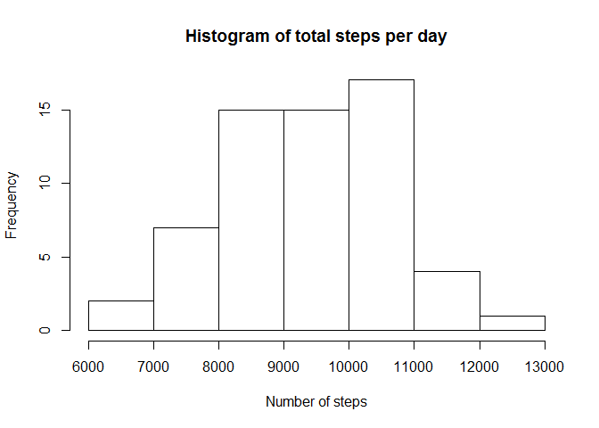
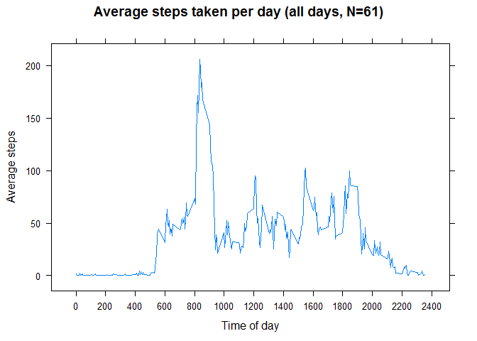
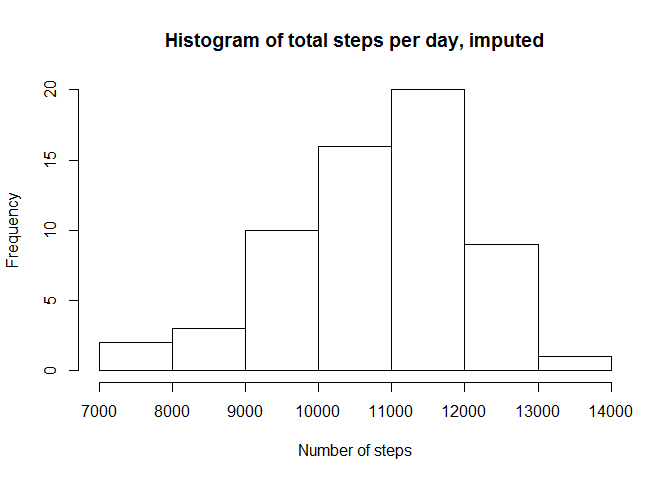
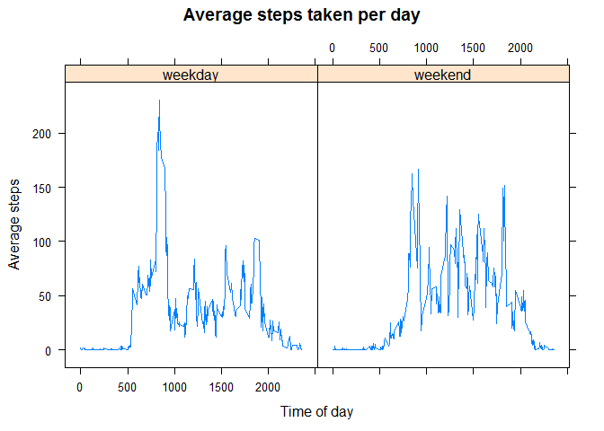

# Reproducible Research: Peer Assessment 1
Jen H  
Monday, March 09, 2015  


## Loading and preprocessing the data

```r
activityData <- read.csv("activity.csv")
```


## What is mean total number of steps taken per day?
1. Calculate the total number of steps taken per day

```r
days <- levels(activityData$date)
stepsSplitDays <- split(activityData$steps, days)
totalPerDay <- sapply(stepsSplitDays, sum, na.rm = TRUE) 
print(totalPerDay)
```

```
## 2012-10-01 2012-10-02 2012-10-03 2012-10-04 2012-10-05 2012-10-06 
##       9048       8678       7184       8716       9912       8208 
## 2012-10-07 2012-10-08 2012-10-09 2012-10-10 2012-10-11 2012-10-12 
##       8047       9408       8744       7780       9898      10296 
## 2012-10-13 2012-10-14 2012-10-15 2012-10-16 2012-10-17 2012-10-18 
##       8167       9154      10189       8720      10610      11388 
## 2012-10-19 2012-10-20 2012-10-21 2012-10-22 2012-10-23 2012-10-24 
##      10709      12036      10334      11461      10490      10071 
## 2012-10-25 2012-10-26 2012-10-27 2012-10-28 2012-10-29 2012-10-30 
##       8671      10072      11524      10791      10819      10046 
## 2012-10-31 2012-11-01 2012-11-02 2012-11-03 2012-11-04 2012-11-05 
##       9147       9134       8739       9626       8987       9369 
## 2012-11-06 2012-11-07 2012-11-08 2012-11-09 2012-11-10 2012-11-11 
##       9752       9777       9789      10480      10493      10334 
## 2012-11-12 2012-11-13 2012-11-14 2012-11-15 2012-11-16 2012-11-17 
##      11045      10686      10829       9073       8746       9925 
## 2012-11-18 2012-11-19 2012-11-20 2012-11-21 2012-11-22 2012-11-23 
##      10609       8043       9821       8224       7675       8354 
## 2012-11-24 2012-11-25 2012-11-26 2012-11-27 2012-11-28 2012-11-29 
##       8617       7197       7627       6064       6481       7025 
## 2012-11-30 
##       7769
```

2. Make a histogram of the total number of steps taken each day

```r
hist(totalPerDay, xlab = "Number of steps", main = "Histogram of total steps per day") 
```

 

3. Calculate and report the mean and median of the total number of steps taken per day

```r
mean(totalPerDay)
```

```
## [1] 9354.23
```

```r
median(totalPerDay)
```

```
## [1] 9408
```

## What is the average daily activity pattern?
1. Make a time series plot (i.e. type = "l") of the 5-minute interval (x-axis) and the average number of steps taken, averaged across all days (y-axis)

```r
# split data into interval periods and calculate means
intervals <- as.numeric(levels(as.factor(activityData$interval)))
stepsSplitInts <- split(activityData$steps, intervals)
avgPerInterval <- sapply(stepsSplitInts, mean, na.rm = TRUE) 

# lattice plot - note there are some quirks in the plot because of NA vals
# instructions to deal with them aren't until next excercise, so I chose to ignore 
xyplot(avgPerInterval ~ intervals, type = "l", xlab="Time of day", ylab="Average steps",
       scales=list( x=list(tick.number=10) ),
       main="Average steps taken per day (all days, N=61)"
       )
```

 

2. Which 5-minute interval, on average across all the days in the dataset, contains the maximum number of steps?

```r
x <- sort(avgPerInterval, decreasing = TRUE)
print(paste0("Time of day with maximum number of steps (", round(x[[1]], digits=2), "): ", sub("([[:digit:]]{2,2})$", ":\\1", names(x[1])) ))
```

```
## [1] "Time of day with maximum number of steps (206.17): 8:35"
```


## Imputing missing values
Note that there are a number of days/intervals where there are missing values (coded as NA). The presence of missing days may introduce bias into some calculations or summaries of the data

1. Calculate and report the total number of missing values in the dataset (i.e. the total number of rows with NAs)

```r
nrow(filter(activityData, is.na(steps)))
```

```
## [1] 2304
```

2. Devise a strategy for filling in all of the missing values in the dataset. The strategy does not need to be sophisticated. For example, you could use the mean/median for that day, or the mean for that 5-minute interval, etc.

3. Create a new dataset that is equal to the original dataset but with the missing data filled in.

```r
activityData2 <- activityData
activityData2 <-  mutate(activityData2, steps = ifelse(is.na(steps), avgPerInterval[as.character(interval)], steps) )
```

4. Make a histogram of the total number of steps taken each day and Calculate and report the mean and median total number of steps taken per day. Do these values differ from the estimates from the first part of the assignment? What is the impact of imputing missing data on the estimates of the total daily number of steps?

```r
# split data into days and calculate total steps per day
days <- levels(activityData2$date)
stepsSplitbyDayI <- split(activityData2$steps, days)
totalPerDayI <- sapply(stepsSplitbyDayI, sum, na.rm = TRUE) 

hist(totalPerDayI, xlab = "Number of steps", main = "Histogram of total steps per day, imputed")
```

 

```r
mean(totalPerDayI)
```

```
## [1] 10766.19
```

```r
median(totalPerDayI)
```

```
## [1] 10789
```

**Yes, the values differ - the average number of steps per day has become larger. But note, the shape of the histogram is quite similar.**


## Are there differences in activity patterns between weekdays and weekends?
For this part the weekdays() function may be of some help here. Use the dataset with the filled-in missing values for this part.

1.  Create a new factor variable in the dataset with two levels - "weekday" and "weekend" indicating whether a given date is a weekday or weekend day.

```r
# create posix datetime column - more than necessary for this assignment, but useful for future
activityData2$datetime <- as.POSIXct(
                # make interval into a proper time format
                paste( C(activityData2$date), 
                paste(substring(sprintf("%04d",activityData2$interval), 1, 2), 
                ":", sep="", substring(sprintf("%04d",activityData2$interval), 3, 4), ":00") )   )

activityData2 <- mutate(activityData2, 
       isWeekend = as.factor(ifelse(is.weekend(activityData2$datetime), "weekend", "weekday") )
       )

# find day of week - useful to remember
# format(activityData2$datetime, "%A")
```


2. Make a panel plot containing a time series plot (i.e. type = "l") of the 5-minute interval (x-axis) and the average number of steps taken, averaged across all weekday days or weekend days (y-axis). See the README file in the GitHub repository to see an example of what this plot should look like using simulated data.

```r
# Calculate average of steps per day type (weekend,weekday) and by time of day (interval)
aD2agg <- aggregate(activityData2$steps,
               list(time = activityData2$interval, wk = activityData2$isWeekend), mean)

# lattice plot
xyplot(x ~ time | wk, 
       data= aD2agg,
       type = "l", xlab="Time of day", ylab="Average steps", 
       scales=list( x=list(tick.number=5) ),
       main="Average steps taken per day"
       )
```

 

**Note, during weekdays the most steps are taken in the early morning. At the weekends, they are spread more evenly throughout the day.**


**WHEW!**
